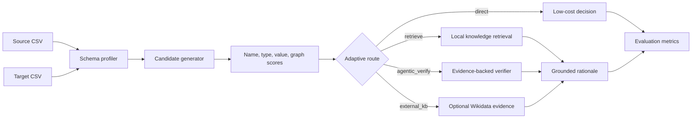

# TrustDI Agentic RAG

[](https://github.com/PRINCE2-AI/trustdi-agentic-rag/actions/workflows/ci.yml)
[](https://www.python.org/)
[](https://platform.openai.com/docs)
[](https://fastapi.tiangolo.com/)
[](https://streamlit.io/)
[](LICENSE)
[](https://github.com/PRINCE2-AI/trustdi-agentic-rag/stargazers)

**A research-backed Agentic RAG system for trustworthy, cost-aware enterprise data integration.**

TrustDI Agent turns the paper **Towards Trustworthy and Cost-Efficient Data Integration: From Naive RAG to Agentic RAG** into a practical LLM engineering project. It profiles CSV schemas, predicts column matches, retrieves semantic evidence, routes ambiguous cases through an agentic verifier, and reports confidence, evidence relevance, review rate, and evaluation metrics.

Paper: [arXiv:2607.22319](https://arxiv.org/abs/2607.22319)

> [!NOTE]
> This is an independent portfolio implementation inspired by the paper. It is not an official implementation and is not affiliated with the paper authors.

## Why TrustDI Agent

Most RAG demos answer questions over documents. Enterprise AI often has a harder problem: connecting messy business data across CRMs, order systems, analytics warehouses, partner CSVs, and product feeds. A model should not guess schema matches silently. It should inspect structure, retrieve evidence, explain uncertainty, and route hard cases differently from easy cases.

- **Data integration focus:** schema matching for real CSV-style enterprise workflows.
- **Agentic RAG routing:** direct, retrieval-backed, agentic verification, and optional external-KB routes.
- **Cost-aware design:** obvious matches avoid unnecessary LLM calls.
- **Evidence trace:** retrieved support is shown for auditability.
- **OpenAI API first:** explanations use the OpenAI API when configured.
- **Offline fallback:** tests and demos run without paid APIs.
- **Evaluation:** precision, recall, F1, confidence, evidence relevance, review rate, and external-KB rate.

## Research Mapping

| Research idea | How TrustDI uses it |
| --- | --- |
| Naive RAG can be noisy and expensive | Adaptive routing avoids fixed retrieval for every pair |
| Agentic RAG improves trust | Ambiguous schema matches go through evidence-backed verification |
| Data integration needs semantic context | Local knowledge notes and optional Wikidata lookup support column meaning |
| Trust requires inspectable decisions | Every match returns route, confidence, rationale, and evidence |
| Cost-efficient DI requires selective reasoning | LLM explanations are reserved for harder routes |

## Architecture



The system returns a match only after the decision path is visible:

```text
column_profiles -> candidate_scores -> route -> evidence -> rationale -> metrics
```

## Quick Start

### 1. Clone and install

```bash
git clone https://github.com/PRINCE2-AI/trustdi-agentic-rag.git
cd trustdi-agentic-rag
python -m venv .venv
```

Windows PowerShell:

```powershell
.\.venv\Scripts\Activate.ps1
pip install -r requirements.txt
Copy-Item .env.example .env
```

macOS/Linux:

```bash
source .venv/bin/activate
pip install -r requirements.txt
cp .env.example .env
```

### 2. Configure OpenAI

Edit `.env` if you want live LLM explanations:

```env
OPENAI_API_KEY=your-openai-api-key
OPENAI_MODEL=gpt-4.1-mini
TRUSTDI_EXTERNAL_KB=false
TRUSTDI_TOP_K=5
TRUSTDI_CONFIDENCE_THRESHOLD=0.72
```

> [!IMPORTANT]
> TrustDI Agent is API-first and uses the OpenAI API when `OPENAI_API_KEY` is configured. The deterministic fallback exists so demos, tests, and GitHub Actions can run without API spend.

## Run

Demo:

```bash
python demo.py
```

API:

```bash
uvicorn app.api:app --reload
```

Dashboard:

```bash
streamlit run app/ui.py
```

Tests:

```bash
pytest -q
```

No-dependency smoke test:

```bash
python tests/run_tests.py
```

## Example Demo

Bundled sample files:

```text
data/samples/crm_orders.csv
data/samples/warehouse_sales.csv
```

The demo maps columns such as:

| Source column | Target column | Expected route |
| --- | --- | --- |
| `customer_email` | `client_email` | `direct` |
| `order_total` | `sales_amount` | `retrieve` |
| `order_date` | `purchase_date` | `direct` |
| `region` | `sales_region` | `retrieve` |
| `product_name` | `item_title` | `direct` |

Example output:

```json
{
  "source_column": "order_total",
  "target_column": "sales_amount",
  "route": "retrieve",
  "decision": "possible_match",
  "confidence": 0.7012,
  "rationale": "Possible Match via retrieve: order_total and sales_amount have confidence 0.70..."
}
```

## API

| Endpoint | Purpose |
| --- | --- |
| `GET /health` | Check API, OpenAI, model, and external-KB status |
| `POST /profile` | Profile one CSV schema |
| `POST /match` | Match two CSV schemas and return evidence-backed decisions |
| `POST /evaluate` | Return matches plus evaluation metrics |

### Match request

```http
POST /match
{
  "source_csv": "data/samples/crm_orders.csv",
  "target_csv": "data/samples/warehouse_sales.csv",
  "gold": {
    "customer_email": "client_email",
    "order_total": "sales_amount",
    "order_date": "purchase_date",
    "region": "sales_region",
    "product_name": "item_title"
  }
}
```

## Evaluation Metrics

| Metric | What it measures |
| --- | --- |
| `precision` | Accepted matches that agree with gold labels |
| `recall` | Gold matches recovered by the system |
| `f1` | Balanced schema matching quality |
| `avg_confidence` | Mean confidence across predicted decisions |
| `evidence_relevance` | Average score of retrieved evidence |
| `review_rate` | Share of pairs routed to human review |
| `external_kb_rate` | Share of decisions using external knowledge lookup |

## Evaluation and observability assets

| Asset | Purpose |
| --- | --- |
| [`data/eval_schema_cases.json`](data/eval_schema_cases.json) | 30-case schema matching eval set covering direct, retrieve, agentic verification, external-KB, negative, type-mismatch, and graph-style ambiguity cases |
| [`docs/evaluation.md`](docs/evaluation.md) | Scoring guide for precision, recall, F1, route accuracy, evidence relevance, review accuracy, and false-positive rate |
| [`docs/observability.md`](docs/observability.md) | Trace schema, dashboard signals, failure taxonomy, and latency/cost reporting template |
| [`docs/case_study.md`](docs/case_study.md) | Recruiter-facing explanation of paper-to-product mapping, architecture, tradeoffs, and limitations |
| [`docs/deployment.md`](docs/deployment.md) | Local, Docker, and Docker Compose run guide |

The included eval set is a benchmark harness seed, not a claim of broad enterprise accuracy. Publish only observed scores from real runs.

## Project Layout

```text
trustdi-agentic-rag/
|-- .github/                  # GitHub Actions CI
|-- app/
|   |-- api.py                 # FastAPI endpoints
|   |-- engine.py              # End-to-end orchestration
|   |-- matching.py            # Agentic schema matching workflow
|   |-- router.py              # Adaptive route planner
|   |-- retrieval.py           # Local semantic evidence retrieval
|   |-- external_kb.py         # Optional Wikidata evidence client
|   |-- graph_memory.py        # Lightweight schema graph memory
|   |-- llm.py                 # OpenAI API explanation adapter
|   |-- evaluator.py           # Precision, recall, F1, evidence metrics
|   |-- profiler.py            # CSV schema profiler
|   `-- ui.py                  # Streamlit dashboard
|-- data/samples/              # Redistributable demo CSVs
|-- docs/                      # Architecture, paper notes, evals, observability, deployment
|-- tests/                     # Offline regression tests
|-- demo.py
|-- .env.example
|-- requirements.txt
`-- README.md
```

## Responsible Use

Schema matching errors can break analytics, reporting, and downstream automation. Treat TrustDI output as decision support, not an automatic production migration tool. Review low-confidence matches, inspect evidence, and add domain-specific benchmarks before using similar logic on sensitive business data.

The included evaluator is a lightweight portfolio-grade implementation. For production, add stronger semantic embeddings, labeled benchmarks, human review workflows, access control, and lineage tracking.

## Roadmap

- [ ] Add OpenAI embeddings for stronger semantic evidence retrieval.
- [ ] Add row-level entity resolution across CSV datasets.
- [ ] Add persistent graph storage with Neo4j or SQLite edge tables.
- [ ] Add human approval UI for `needs_review` matches.
- [ ] Add batch benchmark runner for schema matching datasets.
- [ ] Add cost tracking by route and model call.
- [ ] Publish screenshots and a short demo video.

## Resume Bullets

- Built TrustDI Agent, an OpenAI API-powered Agentic RAG system for trustworthy schema matching and enterprise data integration, inspired by arXiv:2607.22319.
- Implemented adaptive routing across direct matching, evidence retrieval, agentic verification, and optional external knowledge lookup to reduce unnecessary LLM calls while improving traceability.
- Added FastAPI endpoints, a Streamlit observability dashboard, deterministic fallback reasoning, and evaluation metrics for precision, recall, confidence, evidence relevance, and human-review rate.

## Repository Topics

`agentic-rag` `data-integration` `schema-matching` `entity-resolution` `llm-engineering` `openai-api` `fastapi` `streamlit` `rag-evaluation` `enterprise-ai`

## License

The source code is available under the [MIT License](LICENSE). Papers, datasets, and third-party services retain their own licenses and terms.

If this project helps you understand agentic RAG for enterprise data workflows, consider starring the repository.
