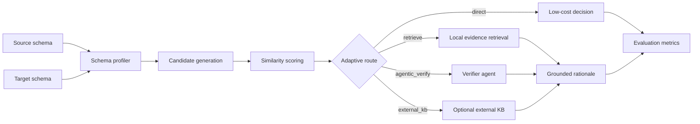

# TrustDI Agentic RAG Case Study

## Problem

Enterprise data integration requires matching messy schemas across CRMs, order systems, warehouses, and partner CSVs. A plain RAG pipeline can retrieve noisy evidence and still produce confident wrong matches. TrustDI Agentic RAG uses adaptive routing, evidence retrieval, and verification to make schema-matching decisions inspectable.

## Research Basis

- Paper: Towards Trustworthy and Cost-Efficient Data Integration: From Naive RAG to Agentic RAG.
- Core idea: move from fixed naive retrieval to cost-aware agentic routing.
- Trust requirement: every decision should expose route, confidence, evidence, and rationale.

## System Design

## Engineering Decisions

- Profiled source and target CSV columns before matching.
- Combined name, type, value, and graph-style scores for candidate ranking.
- Routed easy matches directly to reduce LLM cost.
- Routed ambiguous matches through retrieval-backed verification.
- Returned confidence, evidence, route, and rationale for every match.
- Kept OpenAI explanations optional so demos and CI can run offline.

## Evaluation Evidence

| Metric | Purpose |
| --- | --- |
| Precision | Fraction of predicted matches that are correct |
| Recall | Fraction of true matches recovered |
| F1 | Balance between precision and recall |
| Evidence relevance | Whether retrieved context supports the decision |
| Review rate | How often uncertain cases are routed for verification |
| External-KB rate | How often optional external knowledge is needed |

## Why It Matters For AI Engineering

This project moves RAG into a real business workflow: schema matching, cost-aware routing, confidence reporting, evidence-grounded decisions, and evaluation. It shows applied AI engineering rather than only document chat.

## Limitations

- The portfolio benchmark is small and should not be presented as broad enterprise accuracy.
- External knowledge lookup is optional and disabled unless configured.
- A production data-integration system would need richer connectors, access control, audit logs, and larger golden datasets.

## Next Improvements

- Add a larger schema-matching benchmark with more industries.
- Add ablation tables comparing direct, retrieval, and agentic routes.
- Add live dashboard screenshots.
- Add Docker Compose for API and dashboard review.
